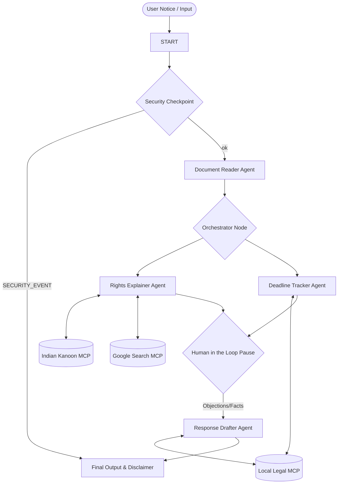

# Submission Writeup — Legal First-Aid Agent

## 1. Problem Statement
Ordinary citizens in India often struggle when they receive official-looking legal notices—such as landlord eviction notices, police summons, bank recovery notices under the SARFAESI Act, or consumer notices. The language is dense, archaic, and intimidating. Access to professional legal counsel is expensive and slow, leading to panic, missed deadlines, and compromised rights. 

The **Legal First-Aid Agent** acts as an immediate, secure triage tool. It helps users understand what a notice means, extracts key facts, warns them of strict deadlines, and drafts legally safe, non-binding reply templates—all while keeping privacy and compliance front and center.

## 2. Solution Architecture

The system uses a graph-based multi-agent layout powered by the **Google ADK 2.0 Workflow Runtime**. Control and state flow sequentially through safety guards and analysis specialists, before pausing for human input to construct the final drafted reply.

## 3. Core Concepts & Code References

This project implements all key components required by the ADK specification:

*   **ADK Multi-Agent Workflow Graph**: Implemented in [`app/agent.py`](file:///c:/Users/rajku/OneDrive/Documents/adk_workspace/legal-first-aid-agent/app/agent.py). It uses the ADK 2.0 `Workflow` engine, function nodes (decorated with `@node`), and sequential/conditional routing.
*   **LlmAgents (Specialized Sub-agents)**: Defined in `app/agent.py`.
    *   `document_classifier_agent`: Parses and categorizes notice facts.
    *   `rights_explainer_agent`: Citations and legal rights analysis.
    *   `deadline_tracker_agent`: Calculates exact target dates.
    *   `response_drafter_agent`: Drafts legal reply templates.
*   **MCP Servers**: Exposes two local stdio Model Context Protocol (MCP) servers:
    *   `app/mcp_server.py`: Local utility tools (`lookup_indian_code`, `calculate_notice_deadline`, `generate_legal_disclaimer`).
    *   `app/indian_kanoon_mcp.py`: Wraps search and case fetches against the official Indian Kanoon endpoint.
    *   `app/google_search_mcp.py`: DuckDuckGo-powered fallback search for recent amendments/news.
*   **Security Checkpoint**: Implemented in `app/agent.py` under `@node(name="security_checkpoint")` to screen inputs before any LLM execution.
*   **Agents CLI**: Scaffolded, packaged, and run using `agents-cli`.

## 4. Security Design

Legal queries are highly sensitive and require absolute confidentiality:
1.  **PII Scrubbing**: The `security_checkpoint` runs regular expression scans to redact sensitive Indian identifiers (such as 10-digit mobile numbers, Aadhar Card numbers, PAN Cards, and emails) from the transient workflow state. Redaction happens *in memory* before queries are sent to models.
2.  **Prompt Injection Shield**: Scans input string for prompt hijacking keywords. If found, it halts the workflow, routes to `SECURITY_EVENT`, and prints a warning.
3.  **Audit Logs**: Prints structured JSON audit logs to standard error (`stderr`) indicating whether PII, injection, or illegal requests were detected, enabling easy observability in production.
4.  **No Storage Rule**: The agent does not persist uploaded notices or legal letters to disk or databases. All data remains in memory during the execution lifecycle.

## 5. MCP Server Design

The application wires three distinct MCP Toolsets to provide factual data:
1.  `lookup_indian_code`: Provides high-quality lookups for foundational civil/criminal codes (e.g., Transfer of Property Act, SARFAESI Act, BNSS/CrPC).
2.  `calculate_notice_deadline`: Computes dates, determines remaining days from today, and flags if a deadline falls on a weekend.
3.  `search_cases` / `get_document`: Integrates with Indian Kanoon to retrieve real case law citations and bare acts.
4.  `google_search`: Performs web searches to catch recent legal news and amendments.

## 6. Human-In-The-Loop (HITL) Flow

A legal reply letter cannot be drafted in a vacuum. It requires the user's side of the story (facts, disputes, or defenses).
*   **Pause Point**: Inside the `orchestrator` node, once document facts, rights, and deadlines are analyzed, the workflow returns a `RequestInput` payload to the client.
*   **Resume Point**: The execution halts. Once the user submits their objections or statements (e.g., *"I have already paid the rent"* or *"The summons notice was served to the wrong person"*), the workflow resumes and the orchestrator passes this human input directly to `response_drafter_agent` to customize the draft.

## 7. Demo Walkthrough
*   **Case 1: Standard Eviction Notice** — Demonstration of the tenant rights lookup under the Transfer of Property Act, deadline calculations, and response template generation.
*   **Case 2: PII Redaction & Rejection** — Demonstrates the immediate shutdown when prompt injection keywords are submitted, and Aadhar/mobile redacting.
*   **Case 3: Critical Summons Notice** — Triggers a bold urgency warning at the top of the report warning the user to seek immediate legal counsel as the deadline is less than 3 days.

## 8. Impact / Value Statement
The **Legal First-Aid Agent** bridges the access-to-justice gap in India. It empowers common citizens, small tenants, and consumers to understand legal threats instantly without fear. By lowering anxiety and providing high-quality educational references, it ensures that citizens do not miss critical deadlines, allowing them to approach qualified advocates prepared and informed.
